## Intro

Scraping is a powerful way to convert web sites into data files that you can analysis with Sheets, Excel, or even ChatGPT.

## Using NotebookLM

Visit [https://notebooklm.google.com/](NotebookLM) and create a **new notebook**.

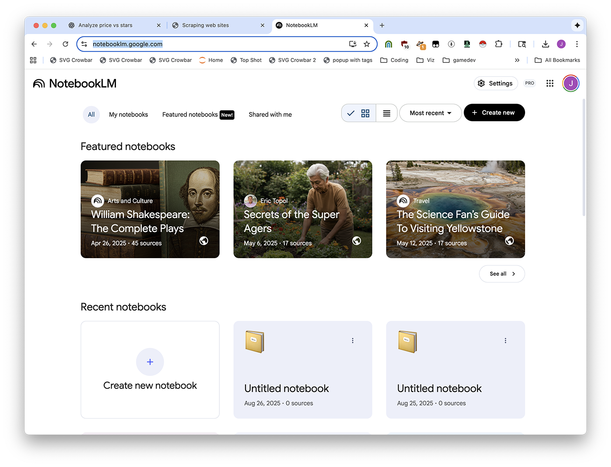

Upload your files.

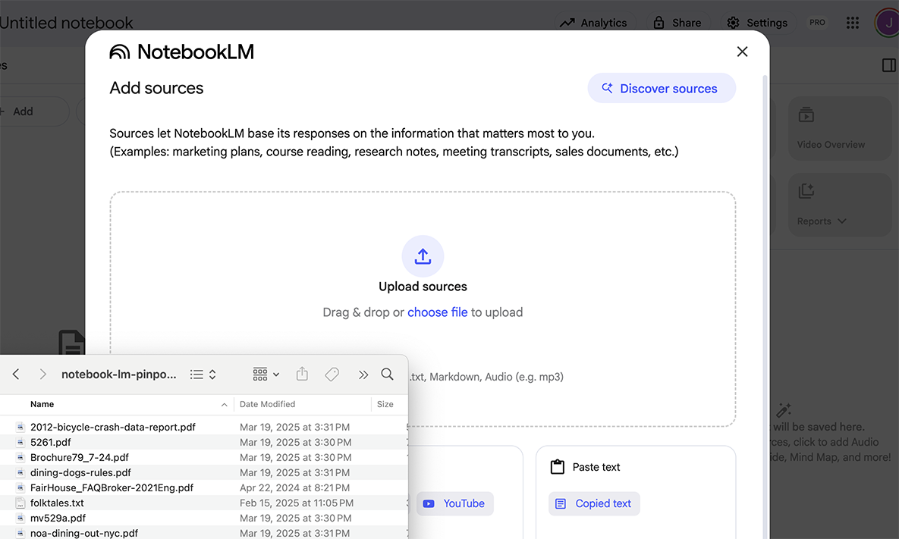

Ask your question.

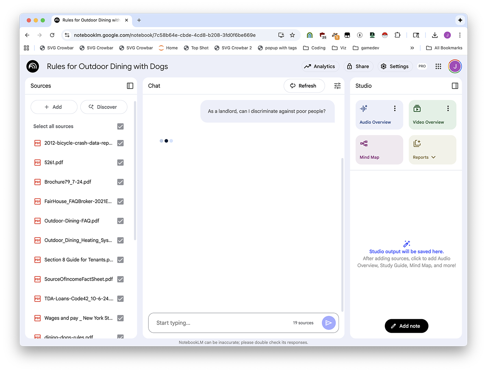

## Using Easy Scraper

After you've installed Easy Scraper, you first need to open it by clicking the extensions button.

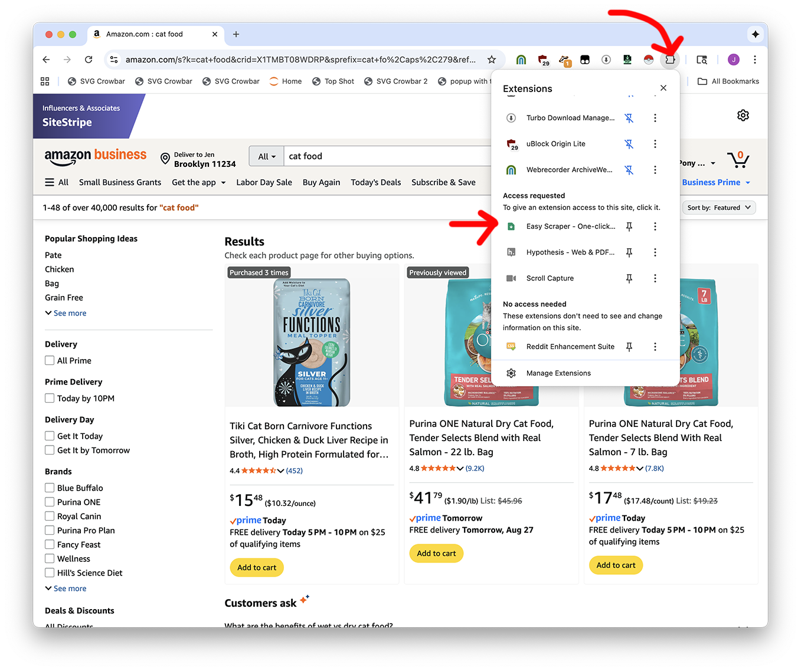

Then you might need to click "Change List" until the rows look reasonably right. Don't worry if there's extra stuff in there, you can clean it up later.

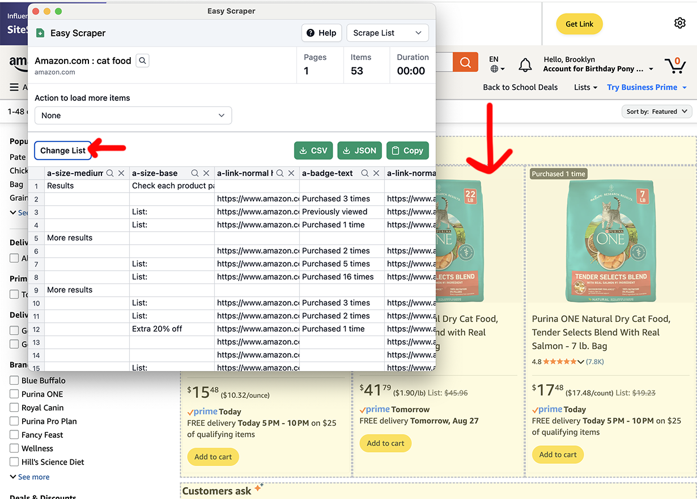

Are there **multiple pages?** Pick an option from the dropdown.

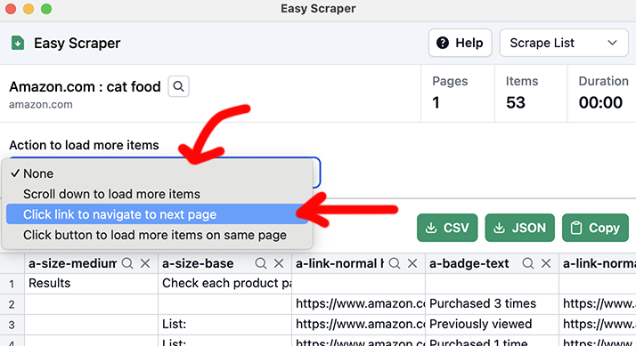

If there's a "Next" button: you'll pick **Click link to navigate to next page**, then **Select**, then click the "Next" button.

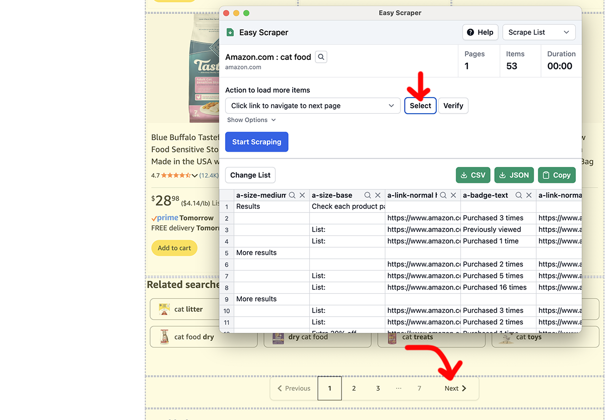

Time to **Start scraping!**

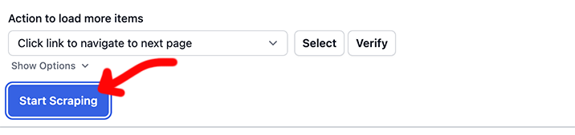

It'll go and go and go and go and go. When you want to be done, click **Stop Scraping**.

<video width="100%" height="auto" autoplay loop muted playsinline>
  <source src="easyscraper-scraping.mov">
</video>

And in the end, export with the **CSV** button.

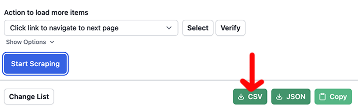

## Running code in Colab

### Getting some code

First, open up your CSV in Google Sheets or Excel.

Explain what you want to ChatGPT. Let's say you asked me, "I want to explore the data" and I said "there's a nice graphing library called Altair that will do that for you"

> [Here's my example](https://chatgpt.com/share/68ae8bc9-2b8c-800d-a701-2ad4e8633c11)
>
> I have the following data in amazon-2025-08-27.csv, i want to analyze it in Google Colab and make an interactive Altair graphic that plots the price per pound vs number of stars.
>
> (paste a few rows of data)

### Using the code

Then, visit [Google Colab](https://colab.research.google.com/) and create a **New Notebook**.

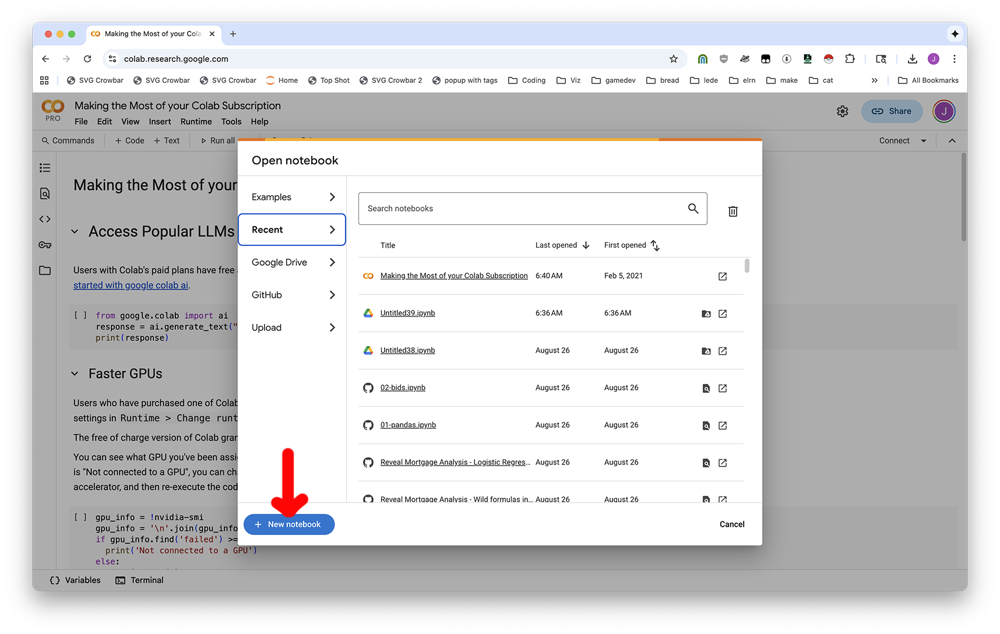

To be able to upload files, click **Run all** to make the notebook start, then click the **Folder button** on the left-hand side.

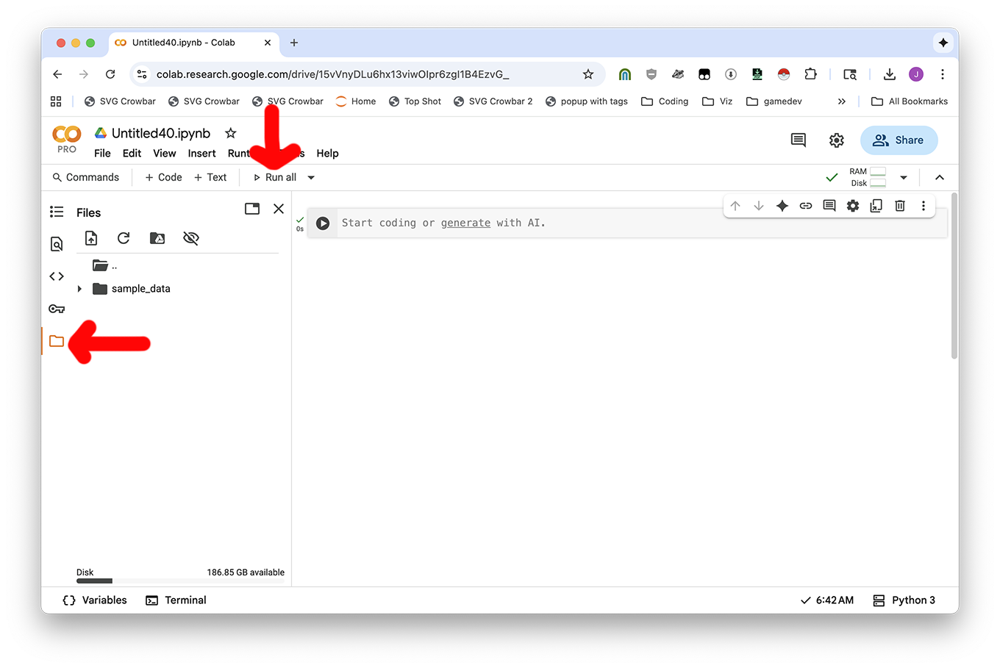

Now you can use the Upload icon or drag-and-drop files in.

<video width="100%" height="auto" autoplay loop muted playsinline>
  <source src="colab-upload-2.mov">
</video>

Now you'll copy the code [from the ChatGPT conversation](https://chatgpt.com/share/68ae8bc9-2b8c-800d-a701-2ad4e8633c11) and put it into your notebook. Use the **+ Code** button to add new blocks of code, and **►** Play button to run your code.

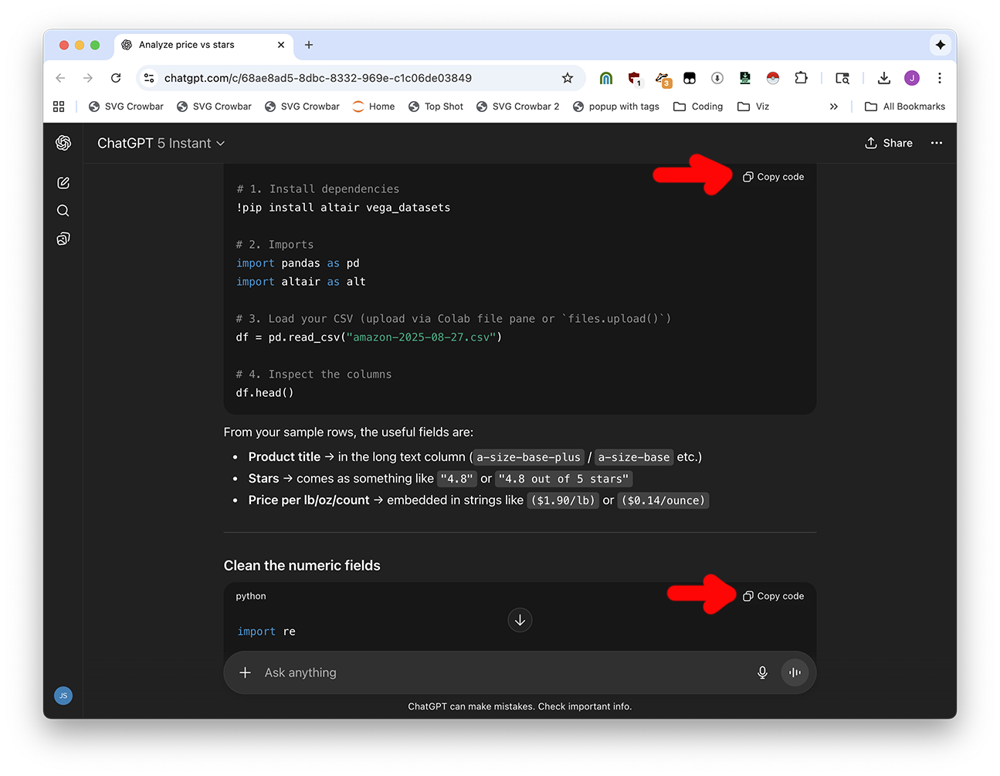

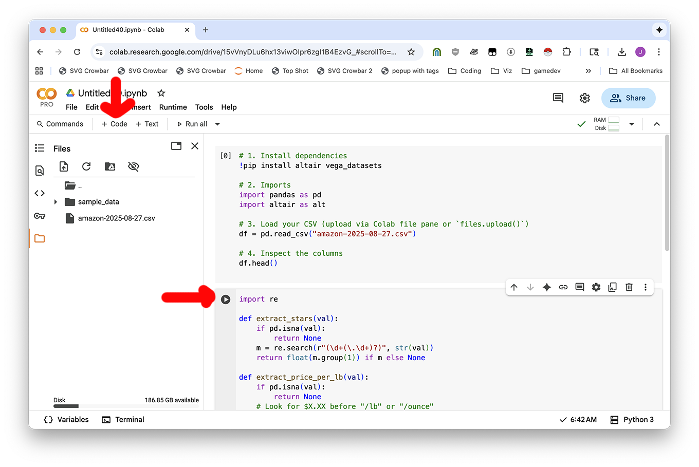

And then you'll be good to go! 

### Downloading "clean" data

If you want to clean your data or download a file analysis, **just ask ChatGPT**. It can give you code to create new, clean CSV files and download them to your computer from Colab.

> Provide code to fully clean the file and download it as something nice I can give a data person. I'm in Google Colab.

## Exercises

### Analyzing Airbnb

1. Visit [Airbnb](https://www.airbnb.com/) for a given region. Search for some time in the future.
2. Scrape the results
3. Find the number of apartments and average cost in each city

### Analyzing a YouTube channel

1. Visit a [Youtube channel](https://www.youtube.com/@joerogan) popular in your country.
2. Ask ChatGPT for code using yt-dlp to download the most recent 10 videos from a specific account or playlist, then to transcribe it using Python Whisper's  "turbo" version and download the results as a CSV file.
3. Upload it into Google Sheets and use Claude for Sheets to summarize or analyze each transcript.

### Analyzing procurement data

1. Scrape the list of [procurement data for Prishtina](https://prishtinaonline.com/prokurimi/njoftim-per-kontrate)
2. Download them all (or some of them, probably) using [Motrix](https://motrix.app/)
3. What questions can you answer with NotebookLM? What questions do you need to convert to a spreadsheet for?